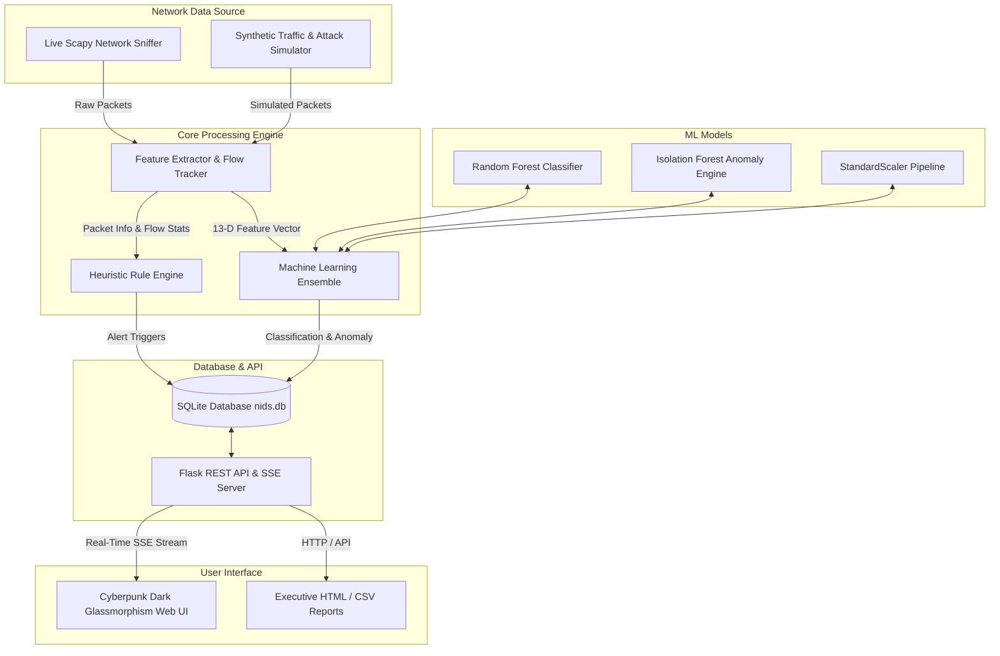

# AI-Powered Network Intrusion Detection System (NIDS)


An enterprise-grade, real-time AI Network Intrusion Detection System (NIDS) built using **Python, Scapy, Machine Learning (Random Forest & Isolation Forest), Flask, and SQLite**. The system monitors live network traffic, extracts flow-level metrics, detects malicious attack vectors (Port Scanning, DoS/DDoS Flooding, SSH/HTTP Brute-Force, Payload Injection), classifies traffic into threat categories, logs events, generates printable executive audit reports, and provides an interactive Cyberpunk Web Dashboard.

---

## 🏛️ System Architecture



---

## ✨ Key Features

- **Multi-Vector Threat Detection**:
  - 🔍 **Port Scanning**: Detects sequential SYN probes across distinct ports.
  - 🌊 **DoS/DDoS Flooding**: Flags extreme packet-per-second spikes and anomalous SYN/ACK ratios.
  - 🔑 **Brute-Force Attacks**: Identifies login flooding on SSH (22), FTP (21), HTTP (80/443), MySQL (3306).
  - 💉 **Payload Injection**: Scans raw packet payloads for SQLi (`UNION SELECT`), XSS (`<script>`), and command execution signatures.
  - 🧠 **Zero-Day Anomaly Detection**: Isolation Forest flags unclassified zero-day anomalies.
- **Dual Sniffer Modes**:
  - **Live Mode**: Scapy packet capture on network interface cards (requires Admin/NPcap).
  - **Simulation Engine**: Embedded synthetic network generator for out-of-the-box evaluation without root privileges.
- **Modern Cyberpunk UI**:
  - Real-time bandwidth throughput charts (Chart.js).
  - Attack classification donut charts.
  - Interactive **Deep Packet Inspector** showing payload hex/string previews.
  - Attacker IP Reputation Matrix with manual **Block/Unblock** controls.
  - Embedded **Interactive Attack Simulator** panel.
- **Reporting & Compliance**:
  - Export structured incident logs to **CSV**.
  - Render printable **Executive HTML Security Audit Reports**.
- **Automated Testing Suite**:
  - 100% unit test coverage for feature extraction, rules, ML inference, DB operations, and REST APIs (`pytest`).

---

## 🚀 Quickstart Guide

### 1. Installation

Clone the repository and install Python dependencies:

```powershell
pip install -r requirements.txt
```

### 2. Machine Learning Pre-Training & DB Seeding

Train the ML models and populate demo sample data:

```powershell
python ml_models/train_model.py
python scripts/seed_demo_data.py
```

### 3. Launch Application

Start the Flask server and NIDS engine:

```powershell
python run.py
```

Access the dashboard in your web browser at:  
👉 **`http://localhost:5000`**

---

## ⚡ Attack Simulator Tool

You can trigger simulated attack vectors directly from the Web UI or programmatically via CLI:

```powershell
# Trigger Port Scan attack
python scripts/simulate_attack.py --attack portscan --count 40 --target 192.168.1.1

# Trigger DoS SYN flood attack
python scripts/simulate_attack.py --attack dos --count 100 --target 192.168.1.1

# Trigger SSH Brute Force attack
python scripts/simulate_attack.py --attack bruteforce --count 25 --target 192.168.1.1

# Inject SQLi Payload
python scripts/simulate_attack.py --attack payload_sqli
```

---

## 🧪 Automated Testing

Execute pytest across the automated test suite:

```powershell
python -m pytest tests/ -v
```

---

## 📁 Repository Structure

```
network security/
├── app/                        # Flask Backend Application
│   ├── api/                    # REST API Blueprints (Dashboard, Alerts, Reports, Settings, Simulator)
│   ├── core/                   # Core NIDS Engine (Sniffer, Feature Extractor, Rules, ML Engine)
│   ├── models/                 # SQLite Database Abstraction
│   └── static/                 # Cyberpunk Web UI (HTML/CSS/JS)
├── docs/                       # Project Documentation & Deliverables
│   ├── PROJECT_REPORT.md       # Comprehensive Technical & Academic Report
│   ├── PRESENTATION.html       # Interactive Slide Deck Presentation
│   └── DEPLOYMENT_GUIDE.md     # Production Deployment Guide
├── ml_models/                  # Machine Learning Training Script & Trained Pickles
├── scripts/                    # Simulator & Seeding Utilities
├── tests/                      # Pytest Automated Test Suite
├── Dockerfile                  # Containerization Build Configuration
├── docker-compose.yml          # Compose File
├── requirements.txt            # Dependency Specifications
└── run.py                      # Application Launcher
```

---

## 📄 License & Attribution

Developed for Network Security & Machine Learning research. Released under the MIT License.
